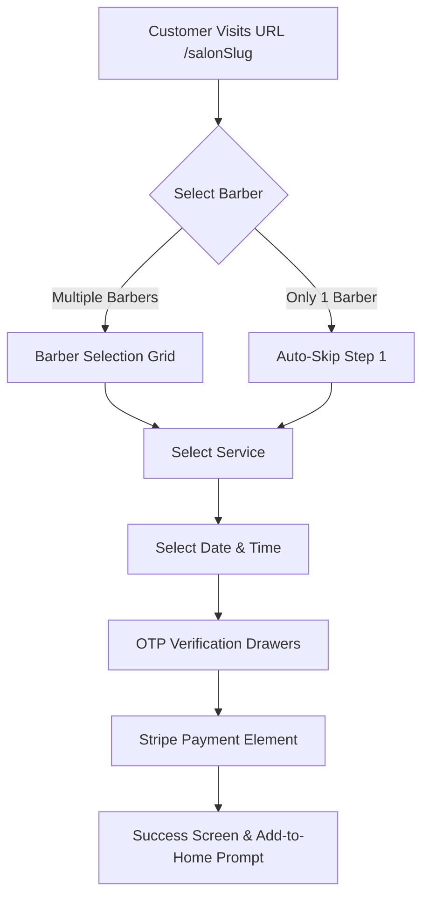

# Trimly — Frontend Architecture & UI Blueprint

This document defines the complete layout, routing, component structure, state management, and user flows for the Trimly Frontend application. Trimly is a premium, multi-tenant B2B/B2C Barbershop SaaS platform built using **Next.js (App Router)**.

---

## 1. Project Directory & Routing Architecture

The project is structured into three isolated Next.js **Route Groups** to handle B2B Marketing, Multi-Tenant Dashboard management, and Public Customer Booking separately.

```text
src/
├── app/
│   ├── (marketing)/                # Zone 1: B2B Marketing (domain.com)
│   │   ├── layout.tsx              # Marketing Navbar & Footer layout
│   │   ├── page.tsx                # Hero, Features, Pricing sections
│   │   ├── terms/page.tsx          # Terms of Service
│   │   └── privacy/page.tsx        # Privacy Policy
│   │
│   ├── (dashboard)/                # Zone 2: B2B Multi-Tenant Dashboard (domain.com/dashboard/*)
│   │   ├── layout.tsx              # ClerkProvider & SubscriptionGuard wrapper
│   │   ├── dashboard/
│   │   │   ├── page.tsx            # Dashboard dispatcher (redirects to calendar or analytics)
│   │   │   ├── calendar/page.tsx   # Barber "Speed-Dial" daily timeline calendar
│   │   │   ├── services/page.tsx   # Service Menu (Add/Edit modals)
│   │   │   ├── analytics/page.tsx  # Personal or Shop Analytics
│   │   │   ├── staff/page.tsx      # Owner Only: Staff management
│   │   │   └── billing/page.tsx    # Owner Only: Stripe billing portal dashboard
│   │
│   │   └── [salonSlug]/            # Zone 3: B2C Mobile-First Booking Link (domain.com/salon-slug)
│   │       ├── layout.tsx          # Clean theme, no B2B navbar, progress bar layout
│   │       └── page.tsx            # Multi-step Framer Motion booking flow component
│   │
│   └── globals.css                 # CSS Design Tokens & Styling
│
├── components/
│   ├── ui/                         # Shadcn primitive elements (Button, Table, Dialog, etc.)
│   ├── marketing/                  # Marketing-specific components
│   ├── dashboard/                  # Sidebar, Topbar, Calendar timeline components
│   └── booking/                    # Step components, OTP Drawer, Stripe Card Element
│
├── hooks/                          # Custom hooks (useCalendar, useStripe, etc.)
├── lib/                            # Utils, API client, Stripe & Clerk config
└── types/                          # TypeScript definitions mapped from backend spec
```

---

## 2. Technology Stack & Design System

### Technology Stack
*   **Framework**: Next.js 14+ (App Router)
*   **Authentication**: Clerk (B2B Dashboard Auth) & Custom Passwordless OTP JWT (B2C Booking Auth)
*   **State Management**: React Context / Zustand (for booking state)
*   **Styling**: Vanilla CSS / TailwindCSS (Clean, Premium, Dark-mode optimized)
*   **Animations**: Framer Motion (for B2C screen transitions and UI feedback)
*   **Charts**: Recharts (for Analytics charts)
*   **Payments**: Stripe SDK & Stripe Payment Element (for security deposits)

### UI Design Philosophy (Vercel/Linear Aesthetic)
*   **Theme**: Sleek dark mode by default, high-contrast, pure grayscale bases (`#000000`, `#0b0b0b`, `#161616`), subtle slate borders, and elegant glassmorphism.
*   **Accent Color**: Crisp white/amber highlighting, smooth hover micro-animations, and clean cards with thin gradient borders.
*   **Typography**: Premium sans-serif fonts (e.g., *Inter*, *Outfit*, or *Geist*).

---

## 3. Zone 1: B2B Marketing Site (`/(marketing)`)

**Purpose**: Showcase Trimly's capabilities and convert visiting barbershop owners into subscribers.

### A. Global Marketing Layout (`layout.tsx`)
*   **Sticky Navbar**:
    *   Left: Minimalist Trimly typography logo (svg icon).
    *   Center: Smooth scrolls links: "Features", "Pricing".
    *   Right: Clerk auth buttons: "Login" (outline) and "Get Started" (high-contrast premium fill button). Clicking either opens Clerk Auth Modals.

### B. Landing Page Components (`page.tsx`)
1.  **Hero Section**:
    *   High-impact typography heading: "Your Shop. Multiplied. No double-bookings."
    *   Subheadline focusing on speed, automated WhatsApp confirmations, and customer retention.
    *   A dynamic, animated mockup representing the daily barber speed-dial calendar timeline.
    *   Call-to-Action (CTA) button: "Start Your 14-Day Free Trial".
2.  **Features Section (Feature Grid / Bento Layout)**:
    *   **Feature A**: The 2-tap manual booking UI (interactively shows a walk-in slot clicked and instantly saved).
    *   **Feature B**: WhatsApp Integration (a mockup of a client receiving a beautiful, automated appointment confirmation message on WhatsApp).
    *   **Feature C**: Custom B2C Booking Link (mockup of the mobile-first customer booking screen displaying `trimly.app/doe-barbershop`).
3.  **Pricing Section**:
    *   Monthly/Yearly toggle switch.
    *   Two clear card tiers:
        *   **Standard (Free Trial)**: First 14 days free, then **$29/month** (or **$23/month** billed yearly). Includes up to 5 barbers, full calendar, analytics, and custom URL.
        *   **Scale Plan**: Standard pricing + **$3/month** per additional barber beyond the initial 5.
4.  **Marketing Footer**:
    *   Links to Terms of Service, Privacy Policy, contact support, and social handles.

---

## 4. Zone 2: Multi-Tenant Dashboard (`/(dashboard)`)

**Purpose**: The operational heart of the barbershop. Separates management concerns (Owner) from day-to-day operations (Barber).

### A. Dashboard Wrapper & Guards
*   **Authentication**: Dashboard is fully wrapped in `<ClerkProvider>`. Unauthenticated visitors are redirected to Clerk sign-in.
*   **Subscription Guard**: An Owner-level middleware wrapper checks the shop’s active subscription status. If `status` is `"EXPIRED"`, `"PAST_DUE"`, or `"NONE"`, the user is locked from using the calendar and redirected to the `billing` screen to purchase a plan or resolve payment.

### B. Shared Global Layout
*   **Sidebar Navigation (Collapsible)**:
    *   Links visible to all users: **Calendar**, **Services**, **Analytics**, **Settings**.
    *   Links visible **only to OWNER**: **Staff**, **Billing**.
*   **Topbar**:
    *   Displays current Shop Name (e.g., "Doe Barbershop").
    *   User role badge (e.g., `Owner` in amber border, `Barber` in green border).
    *   Clerk `UserButton` in the corner for profile edits and sign-out.

### C. Owner UI (Admin View)
1.  **Staff Management Page (`/staff`)**:
    *   Main view: A Shadcn UI data table listing all barbers (Name, Email, Role, Total Bookings).
    *   Action button: "➕ Add Barber". Opens a modal to input: Name, Email, and initial password. This calls `/shops/me/barbers` to add the barber.
2.  **Shop Analytics Page (`/analytics`)**:
    *   Overview cards: Total shop revenue (Recharts area chart), total completed/cancelled bookings, active barber count.
    *   Barber breakdown: Bar chart comparing performance/earnings per barber.
3.  **Billing Page (`/billing`)**:
    *   Displays current subscription tier (Monthly/Yearly), renewal date, Stripe card details.
    *   Button: "Manage Subscription". Calls `/shops/me/billing-portal` to fetch the Stripe Billing Customer Portal link and redirects the user there.

### D. Barber UI (Daily Driver View)
1.  **The "Speed-Dial" Calendar (`/calendar`)**:
    *   A highly responsive vertical time-grid calendar (each hour divided into 15-minute slots).
    *   **Interactive quick-add**: Clicking any open time block opens the **Quick-Add Modal** instantly.
        *   Form: Select Service (dropdown of active services), input walk-in Customer Name (optional), phone number (optional), and Notes.
        *   Saving completes the booking in under 3 taps (saving as a `MANUAL` walk-in booking via API).
    *   **Color Coding**: Blue blocks denote customer online bookings (`ONLINE`), Green blocks denote manual entries (`MANUAL`).
2.  **Service Menu (`/services`)**:
    *   A list view showing all services the logged-in barber offers.
    *   Action: "Add Service" / "Edit Service" opens a Dialog form (Name, Price in £/$, Duration in minutes). Calls `POST /services` or `PUT /services/{id}`.
3.  **Personal Analytics (`/analytics` - Barber version)**:
    *   Displays individual statistics: Total personal bookings, completion rate, daily/weekly/monthly estimated payout.

---

## 5. Zone 3: The B2C Booking Flow (`/[salonSlug]`)

**Purpose**: A lightning-fast, mobile-first booking experience for customers.

### A. General Design & Layout
*   **No Header/Footer**: Clean, app-like environment. Small sticky top header showing the Shop Name, progress bar (e.g., step indicator), and a "Back" arrow.
*   **Transitions**: Uses Framer Motion for smooth horizontal slides between steps.
*   **Speed Constraint**: Designed to load in under 1 second, prioritizing speed and simple interactive tap points.

### B. Interactive Steps


1.  **Step 1: Select Barber**:
    *   List of elegant cards featuring the Barber's avatar, name, and bio.
    *   *Frontend Logic*: If the API payload contains only one barber, the UI automatically skips this step and proceeds to Step 2.
2.  **Step 2: Select Service**:
    *   Displays all active services offered by the chosen barber.
    *   Shows name, duration (e.g. 30 min), and price formatted cleanly (e.g. £25.00). Tap to select and go to Step 3.
3.  **Step 3: Select Date & Time**:
    *   **Date Picker**: Horizontal date scroller at the top (displays next 14 days, highlighting today/tomorrow).
    *   **Time Slots**: A grid showing available 15-minute time blocks fetched from `/bookings/barber/{clerkId}/availability`. Non-available slots are hidden.
4.  **Step 4: Identity & Verification (OTP Drawer)**:
    *   A bottom sheet/drawer slides up.
    *   Customer enters their WhatsApp or phone number.
    *   API call `/auth/customer/send-otp` is made.
    *   The drawer transitions to a 6-digit OTP code entry.
    *   Once verified via `/auth/customer/verify-otp`, a Customer JWT is stored in local storage/cookies for authentication.
5.  **Step 5: Deposit & Payment**:
    *   Stripe Payment Element displays inside the drawer to secure the booking deposit.
    *   Customer clicks "Pay & Book", completing the checkout transaction.
6.  **Success View**:
    *   A full-screen layout showing a "✅ Booking Confirmed" animation.
    *   Displays appointment summary (Barber, Service, Date, Time, Location).
    *   **Add to Home Screen**: Prompts user to install the link as a progressive web shortcut for instant booking next time.

---

## 6. API Integration Matrix

All UI components map directly to the backend routes documented in `backend-api.md`:

| Component / Page | Method | Endpoint | Purpose |
| :--- | :--- | :--- | :--- |
| **Zone 1: Pricing Toggle** | `POST` | `/shops/me/subscribe` | Initializes checkout for monthly/yearly subscription |
| **Zone 2: Staff Table** | `POST` | `/shops/me/barbers` | Shop Owner adds a new barber |
| **Zone 2: Billing Screen** | `POST` | `/shops/me/billing-portal` | Opens customer payment portal on Stripe |
| **Zone 2: Calendar Timeline** | `POST` | `/bookings/manual` | Barber creates a manual booking |
| **Zone 2: Service Form** | `POST` / `PUT` | `/services` / `/services/{id}` | Barber creates or updates services |
| **Zone 2: Owner Charts** | `GET` | `/statistics/shop` | Populates shop analytics |
| **Zone 3: Barber Select** | `GET` | `/shops/{slug}` | Pulls shop info and team list publically |
| **Zone 3: Service Menu** | `GET` | `/services/barber/{clerkId}` | Renders service list for the client |
| **Zone 3: Time Selection** | `GET` | `/bookings/barber/{clerkId}/availability` | Calculates open slots for a specific day |
| **Zone 3: Booking Drawer** | `POST` | `/bookings/online` | Creates booking and returns Payment Intent |
| **Zone 3: OTP Drawer** | `POST` | `/auth/customer/send-otp` | Sends confirmation code |
